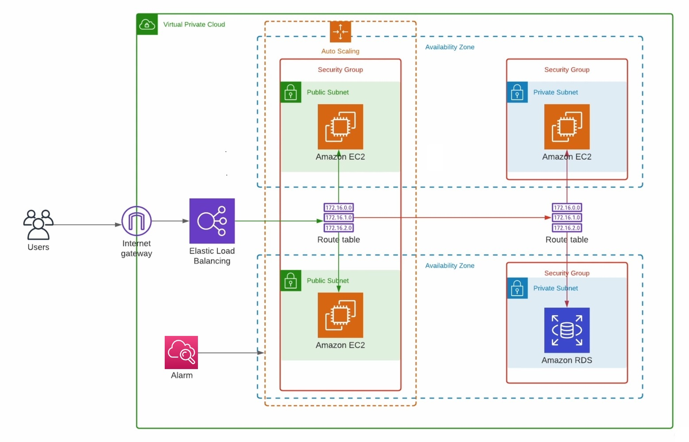

# Terraform Auto Scaling Instances AWS

Este repositório contém um exemplo de código Terraform que provisiona um cenário bem comum em muitas empresas.
- Instâncias (EC2) em duas AZ (zonas de disponibilidade) diferentes com Load Balancer e Auto Scaling. 
- Instância (EC2) conectada em um Banco MySQL (RDS), ambos recursos privados.
Essa abordagem demonstra como é possível implementar dois cenários distintos de utilização de forma prática usando Terraform.


#### Envs:
Neste exemplo, adotei variáveis de ambiente para fácil execução local e na pipeline. 
```bash
export AWS_ACCESS_KEY_ID=XXXXXXXXXXXXXX
export AWS_SECRET_ACCESS_KEY=YYYYYYYYYYYYYYYYYYYYYYYYYYY
export TF_VAR_aws_key_pub='ssh-rsa 123123123123'
export TF_VAR_db_user='user'
export TF_VAR_db_password='senha123'
```

## Pré-requisitos

Certifique-se de ter o Terraform instalado em sua máquina local. Você pode baixar a última versão do Terraform em [terraform.io](https://www.terraform.io/downloads.html).

Além disso, configure suas credenciais para AWS e Azure para que o Terraform possa autenticar e provisionar recursos em ambas as nuvens. 

## Como usar

1. Clone este repositório:

    ```bash
    git clone https://github.com/vgsousa/terraform-multicloud-instances.git
    cd terraform-multicloud-instances
    ```

2. Inicialize o diretório do Terraform:

    ```bash
    terraform init
    ```

3. Personalize as variáveis de acordo com suas necessidades. Edite o arquivo `variables.tf` para definir valores específicos, como nomes, regiões, etc.

4. Execute o plano Terraform para verificar as alterações propostas:

    ```bash
    terraform plan
    ```

5. Se o plano estiver correto, aplique as alterações:

    ```bash
    terraform apply
    ```

    Será necessário confirmar a ação digitando "yes" quando solicitado.

6. Após a conclusão, você verá a saída indicando os IPs ou outros detalhes relevantes sobre as instâncias criadas.

7. Para destruir os recursos provisionados, execute:

    ```bash
    terraform destroy
    ```

    Confirme a ação digitando "yes" quando solicitado.

## Estrutura do Projeto

O projeto possui a seguinte estrutura:

- `main.tf`: Contém a definição dos recursos Terraform.
- `variables.tf`: Declaração de variáveis usadas nos demais arquivo.
- `outputs.tf`: Define as saídas que serão exibidas após a execução do Terraform.
- `locals.tf`: Arquivo opcional para definir valores específicos.
- `aws-*.tf`: Arquivos dos recursos a serem provisionados AWS.

## Fonte

Projeto inspirado pelo [CLEBER GASPAROTO](https://www.clebergasparoto.com).

## Licença

Este projeto está licenciado sob a licença MIT - veja o arquivo [LICENSE](LICENSE) para mais detalhes.
